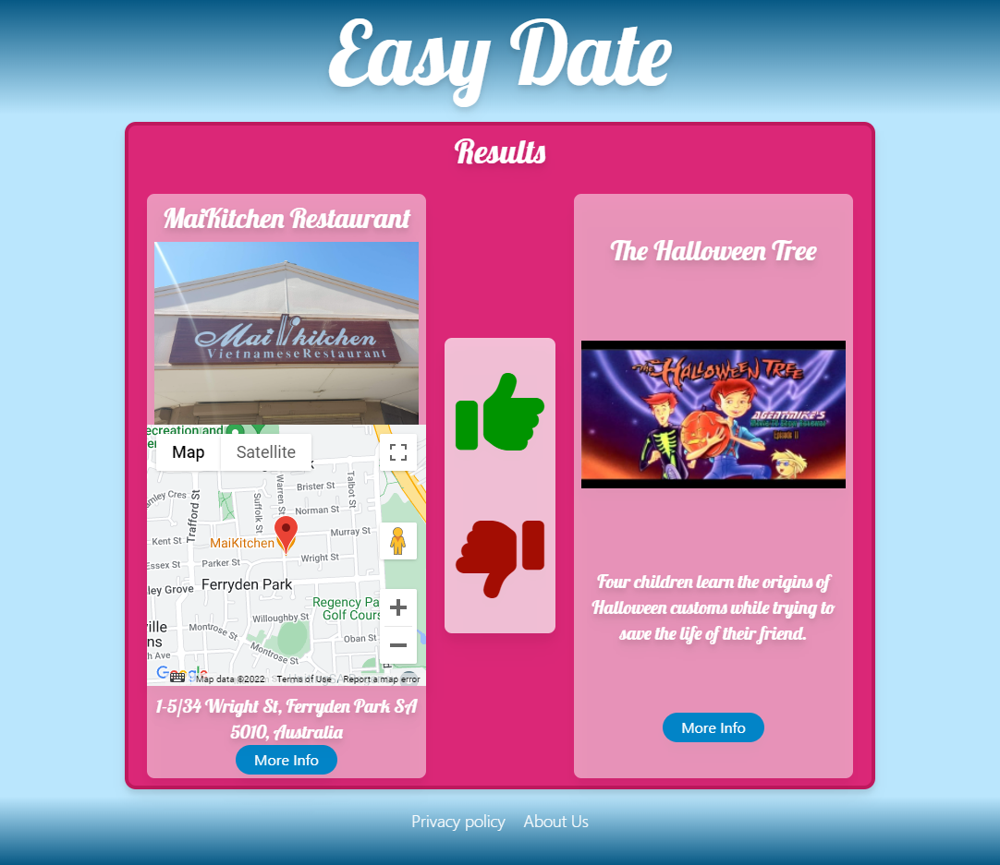

# Easy Date Readme
A Group-5 product

**About Easy-Date-project-1**

Our project engineers a solution to a social problem. Our mission was to target the desperate and dateless community and solve their dating woes with a simple application. The Easy-Date application takes the stress away from making some of life's critical decisions we all have experienced in the dating game.

The project was created mainly to organise date options for users quickly and easily, where time is of the essence. When a user enters our Easy-Date website, they are presented with a series of questions to determine thier mood. We analysis the users mood based on favourite colour, horoscope, pet preference, favorite colour and season. From these reults of the user choices, the Easy-Date website chooses a style of food and a correseponding movie that is aligned to your mood. If you think "Im Amped" you want to watch "100 rifles - Western right? 

A summary of the results and images of the food style and movie tittle are then shown and if the customer likes the combination the like button will save the choice. If the customer dislikes the option the dislike button will rerun the movie query for new offerings.

If you are looking for love and enticing the perfect life partner, let me introduce you to, Easy Date!

**Homework Task**

Welcome to the Full-Stack Boot Camp! This is the most important factor that influences how well and quickly we learn something, not only how we structure and sequence our learning, but also how we stay motivated and curious about the material, plus how we leverage our prior knowledge to build new knowledge we can apply in different situations. 

Learning how to become a web developer isn't easy. It takes a lot of internal drive and outside support. To make that journey a bit easier, the course curriculum is structured and sequenced to keep motivation high and connections between concepts clear. 

The first third of the course focuses on the frontend; the words, images, and forms you see and interact with in the browser, or when you click a login button and a dialog box pops up. Front-end languages, techniques, and libraries are foundational to being a full-stack developer,these skills been continued throughout the course leading into Project-1.

## Project 1

Project one for gorup-5 became an Easy-date application and was taxing, but is something we can look back on and to be proud of. It’s totally possible to build a cool interactive web application after the first few weeks by developing the front-end ourselves and leveraging servers and APIs. For example, Easy-Date uses Google maps and MovieDb API, browser local storage,  creates HTML elements from Javascript  and uses the Tailwind CSS framework.

**Completed site**

-Site URL
https://mattdryan.github.io/Easy-Date/

- Application Screenshots:

**Project Goal**

The technical project goal was to combine the skills and strenghts of five indivuduals to intergrate the concepts learned in the first third of the project. A team goal was to use at least two remote APIs to bring back data that could be created as elements in our application. We decided early on we wanted to use local storage and leave the styling to a utility to provide customisable CSS styling, to this end we choose, tailwind.

**Get started with the project**

Follow these instructions to create your project and deploy it to GitHub Pages:

1. Create a new repository on your GitHub account and clone it to your computer.

2. When you're ready to deploy, use the `git add`, `git commit`, and `git push` commands to save and push your code to your GitHub repository.

3. Navigate to your GitHub repository in the browser and then select the Settings tab on the right side of the page.

4. On the Settings page, scroll down to the GitHub Pages section. Then, in the section labelled Source, select the `main` branch as your source.

5. Navigate to <your-github-username.github.io/your-repository-name> and you will find that your new webpage has gone live! For example, if your GitHub username is "lernantino" and the project is "CSS-demo-site", then your URL would be <lernantino.github.io/css-demo-site>.

You can also refer to this [YouTube video on enabling GitHub Pages](https://youtu.be/P4Mu1t5rIXg) for more guidance.

> **Important**: It might take a few minutes for GitHub pages to display your site correctly. If your project does not deploy or display correctly, check that all file paths in your application are relative and use the right casing. GitHub is case-sensitive, an incorrect capital or lowercase letter could cause problems in deployment.

Be sure to add, commit, and push your work to see the most up-to-date version of your app!

**Points of interest**

**Need help with the project?**

